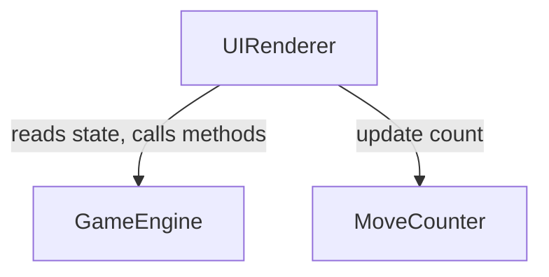

# Components — River Crossing Puzzle Web App

```yaml
components:
  - name: GameEngine
    summary: Owns all game rules, state, and logic for the river crossing puzzle.
    behaviour: >
      Maintains the authoritative game state (positions of all characters and the boat).
      Enforces the constraint rules: Fox + Chicken unsupervised is invalid; Chicken + Grain
      unsupervised is invalid; Farmer supervises any pair on the same bank.
      The boat cannot cross empty — Farmer must always be aboard.
      The boat carries at most one passenger in addition to the Farmer.
      Tracks move count (incremented on each successful crossing).
      Detects win condition: all four characters on the right bank.
      Exposes a GameState class with methods: selectCharacter(), loadToBoat(),
      cross(), reset(), isValid(), isWon().
    responsibilities:
      - Maintain game state (character positions, boat position, move count)
      - Validate moves against constraint rules
      - Detect win condition
      - Expose state mutation methods
      - Expose state query methods
    depends_on: []
    dependents:
      - component: UIRenderer
        interaction: Reads game state and calls mutation methods on user interaction
      - component: MoveCounter
        interaction: Reads move count from game state
    external_dependencies: []
    entities:
      - name: GameState
        identifier: (singleton — one instance per game session)
        attributes: [leftBank, rightBank, boatBank, boatPassenger, moveCount, selectedCharacter, status]
      - name: Character
        identifier: name
        attributes: [name, location]

  - name: UIRenderer
    summary: Renders the game board and handles all user interaction events.
    behaviour: >
      Reads GameEngine state and renders the current positions of all characters,
      the boat, and the river to the DOM. Attaches click event listeners to
      characters and the boat. On character click, calls GameEngine.selectCharacter().
      On boat click, calls GameEngine.loadToBoat() if a character is selected,
      or GameEngine.cross() if the boat is ready to cross. Re-renders after every
      state change. Displays win overlay when GameEngine.isWon() is true.
      Delegates move count display to MoveCounter.
    responsibilities:
      - Render game board (river, banks, characters, boat) from GameEngine state
      - Handle character click events
      - Handle boat click events
      - Trigger re-render after each state mutation
      - Display win overlay with play-again button
    depends_on:
      - component: GameEngine
        interaction: Reads state, calls selectCharacter / loadToBoat / cross / reset
        style: sync
      - component: MoveCounter
        interaction: Passes current move count for display
        style: sync
    dependents: []
    external_dependencies:
      - name: Browser DOM
        kind: other
        purpose: Rendering and event handling
    entities: []

  - name: MoveCounter
    summary: Displays the current move count to the user.
    behaviour: >
      Receives the current move count from UIRenderer and updates the DOM element
      showing the count. Resets to zero when the game is reset.
    responsibilities:
      - Display current move count
      - Reset display on game reset
    depends_on: []
    dependents:
      - component: UIRenderer
        interaction: Calls update(count) to refresh the displayed value
    external_dependencies:
      - name: Browser DOM
        kind: other
        purpose: Rendering move count element
    entities: []
```

---

## Component Diagram



<!-- Text fallback: UIRenderer depends on GameEngine (reads state, calls mutation methods) and on MoveCounter (passes move count for display). GameEngine and MoveCounter have no outbound dependencies. -->

---

## Component Summary

| Component | Purpose | Depends On | Dependents | Entities Owned |
|---|---|---|---|---|
| GameEngine | All game rules, state, and logic | — | UIRenderer, MoveCounter | GameState, Character |
| UIRenderer | Board rendering and user interaction | GameEngine, MoveCounter | — | — |
| MoveCounter | Move count display | — | UIRenderer | — |

---

## Entity Ownership

| Entity | Owning Component | Identifier | Attributes | References |
|---|---|---|---|---|
| GameState | GameEngine | singleton | leftBank, rightBank, boatBank, boatPassenger, moveCount, selectedCharacter, status | — |
| Character | GameEngine | name | name, location | — |

---

## External Dependencies

| Component | Dependency | Kind | Purpose |
|---|---|---|---|
| UIRenderer | Browser DOM | other | Rendering and event handling |
| MoveCounter | Browser DOM | other | Rendering move count element |

---

## Rationale

| Component | Why a separate building block |
|---|---|
| GameEngine | Distinct concern (rules + state), distinct change rate from UI, independently testable without DOM |
| UIRenderer | Distinct concern (presentation + interaction), depends on GameEngine but owns no business logic |
| MoveCounter | Distinct display concern; isolated so it can be updated independently without re-rendering the full board |
